# Robustness of Vision Algorithms under Image Distortions

**Image Processing Course Final Project** 
Team: yuval Chen · Lina Biniashvili · Adi Gilboa
Repository: [yyyuval/image-processing-project](https://github.com/yyyuval/image-processing-project)
This repository is the course submission. The README is the project report.

---

## 1. Project objective

We evaluate how classical and deep vision methods degrade when images are corrupted, and how much performance can be recovered by:

1. classical **enhancement / preprocessing**, and  
2. **fine-tuning** a deep detector on distorted images.

Protocol (course Parts 1–4):

1. Measure on **clean** images  
2. Apply distortions at multiple severities and measure degradation (**per SNR / intensity**)  
3. Enhance distorted images and re-measure  
4. Fine-tune YOLO on distorted images and re-measure  

---

## 2. Experimental choices 

| Component | Choice | Why |
|-----------|--------|-----|
| **Dataset** | ADE20K / SceneParse150 via Hugging Face `merve/scene_parse_150` (**500** validation images, 512×512) | Public dataset with **semantic GT masks** |
| **Tasks (4)** | ORB features · Canny edges · YOLOv8 detection · SegFormer segmentation | Mix of **low-level + high-level**; ≥1 DL model |
| **Distortions (4)** | Gaussian noise · JPEG compression · Low light · Synthetic rain | Common camera / codec / weather degradations |
| **Enhancements (4)** | Non-Local Means · Bilateral+interpolation · CLAHE · Streak-targeted derain | One matched restore method per distortion (course guidance) |
| **Fine-tuning** | YOLOv8n on Gaussian-noise images (intensity 0.6), labels from clean detections | Course Part 4 |
| **Severity** | `L1…L5` from intensities `[0.2, 0.4, 0.6, 0.8, 1.0]` | Required multi-level evaluation with SNR/PSNR |

### Distortion → enhancement map

| Distortion | Enhancement |
|------------|-------------|
| Gaussian noise | Non-Local Means (OpenCV, noise-adaptive `h`) |
| JPEG compression | Upsample/downsample interpolation + bilateral filter |
| Low light | CLAHE on L channel |
| Rain | Bright-streak mask + inpainting |

### Metrics

| Task | Primary metric | Kind |
|------|----------------|------|
| ORB features | Match accuracy vs clean-image ORB | Stability |
| Canny edges | Edge F1 vs clean Canny | Stability |
| YOLOv8 detection | Detection F1 vs clean YOLO boxes (+ GT localization vs mask-derived boxes) | Stability / GT |
| SegFormer segmentation | **mIoU** vs ADE20K masks | Ground truth |

We also record **activity** metrics (e.g. `#keypoints`, `#detections`, confidence) and **SNR/PSNR** vs clean for every distorted/enhanced sample.

---

## 3. Distortions, severity and recovery

Each distortion is applied at five severity levels. We quantify pixel change with

**SNR = 10·log₁₀(P_signal / P_noise)** (and PSNR).

**Distortion Modeling Methodology**

To rigorously evaluate robustness, distortions were implemented as parametric models simulating real-world sensor and environmental conditions:
* **Gaussian Noise:** Simulated as Additive White Gaussian Noise (AWGN) sampled from a normal distribution. The standard deviation ($\sigma$) is scaled strictly according to the normalized intensity level to simulate varying degrees of sensor thermal noise[cite: 29, 32].
* **JPEG Compression:** Replicates bandwidth-constrained transmission artifacts. The image is actively encoded and decoded using standard JPEG compression, with the quality factor inversely scaled against the intensity level[cite: 31, 32].
* **Low-Light Degradation:** Implemented as a dual-action transform. It applies a linear gain reduction combined with a non-linear Gamma correction ($\gamma > 1$) to aggressively darken midtones, realistically simulating camera sensor underexposure[cite: 30, 32].
* **Synthetic Rain:** Generated parametrically via randomized, slanted lines (-25 degrees) whose density and length scale with the intensity level. A Gaussian blur is applied to the streaks prior to blending to simulate motion blur and depth of field[cite: 28, 32].
* **Severity Ladder (L1-L5):** To ensure a controlled experiment, all severity levels correspond to a normalized intensity scale $[0, 1]$. This scale mathematically dictates the underlying physical parameters for all four distortions[cite: 26, 32].

Mean SNR over the **500-image** run:

| Distortion | L1 SNR (dB) | L3 SNR (dB) | L5 SNR (dB) | Paired enhancement |
|------------|-------------|-------------|-------------|--------------------|
| Gaussian noise | 24.4 | 15.1 | 11.0 | Non-Local Means |
| JPEG compression | 33.3 | 29.0 | 22.6 | Bilateral + interpolation |
| Low light | 9.4 | 3.3 | 0.5 | CLAHE |
| Rain | 36.1 | 28.5 | 23.7 | Streak-targeted derain |

Full table: `results/report/snr_by_severity.csv`.

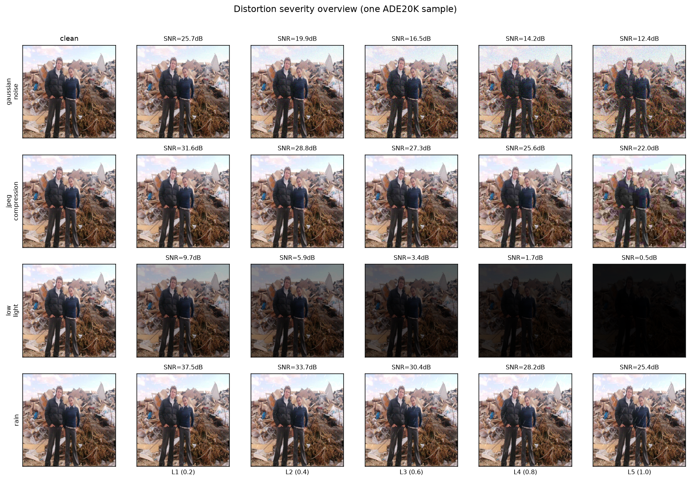

*Figure 1 — Clean sample and all five severity levels for every distortion. Panel labels show per-image SNR. Low light changes brightness strongly (low SNR); rain and mild JPEG can look subtle while still affecting detectors.*

**Enhancement Methodology**
* **Non-Local Means (for Gaussian Noise):** Unlike standard linear filters that uniformly blur images, NLM leverages self-similarity across the spatial domain. It averages pixels with similar local neighborhoods, effectively cancelling out zero-mean Gaussian noise while preserving high-frequency structural details.
* **Bilateral Filtering (for JPEG Compression):** To mitigate block artifacts caused by DCT quantization, the bilateral filter applies a combined domain (spatial) and range (intensity) kernel. This selectively smooths homogeneous regions while halting diffusion across strong gradients, strictly preserving edges.
* **CLAHE (for Low-Light Recovery):** Standard global histogram equalization often amplifies noise in dark, uniform regions. CLAHE mitigates this by computing local histograms and clipping the distribution (limiting the contrast gain) before applying the cumulative distribution function, yielding balanced local enhancement without blowing out noise.
* **Masking & Inpainting (for Rain Removal):** Rain artifacts introduce high-frequency, directional structural noise. The recovery process isolates these features utilizing a bright-streak mask, followed by an inpainting algorithm that interpolates the missing pixels from their immediate, uncorrupted surroundings to seamlessly restore the background scene.

---

## 4. How to reproduce

```bash
python3 -m venv .venv
source .venv/bin/activate
pip install -U pip
pip install -e .
pip install -r requirements.txt

# Full experiment (~500 images; long-running)
python scripts/run_experiment.py --config configs/default.yaml

# Fast smoke test (synthetic, classical tasks only)
make smoke
```

Stage scripts: `scripts/01` … `scripts/10`, plus `scripts/00_validate_pipeline.py`.  
Configuration: `configs/default.yaml` (`max_samples: 500`).

# Testing & Quality Assurance
To ensure the robustness and accuracy of our evaluation pipeline, we implemented a comprehensive test suite:
- Algorithm Validation: Unit tests strictly validate classical CV metrics (e.g., ORB matching stability, mIoU edge cases) and mathematically verify that our enhancements empirically improve PSNR metrics compared to raw distortions.
- Integration (Smoke) Testing: We developed a fast, automated smoke test utilizing a dynamically generated synthetic dataset. This verifies the end-to-end pipeline execution (Clean $\rightarrow$ Distort $\rightarrow$ Enhance) and artifact generation without requiring the full ADE20K payload.  

---

## 5. Results (500 ADE20K images)

Compact tables: `results/report/`. All report figures: `results/figures/`.

### 5.1 Clean baseline

| Task | Method | Primary metric | Mean |
|------|--------|----------------|------|
| Features | ORB | match_accuracy | 1.000 |
| Edges | Canny | edge_f1 | 1.000 |
| Detection | YOLOv8n | detection_f1 (vs clean ref) | 1.000 |
| Segmentation | SegFormer-B0 | **mIoU (GT)** | **0.456** |

SegFormer clean mIoU ≈ 0.46 is a realistic pretrained baseline on diverse ADE scenes.

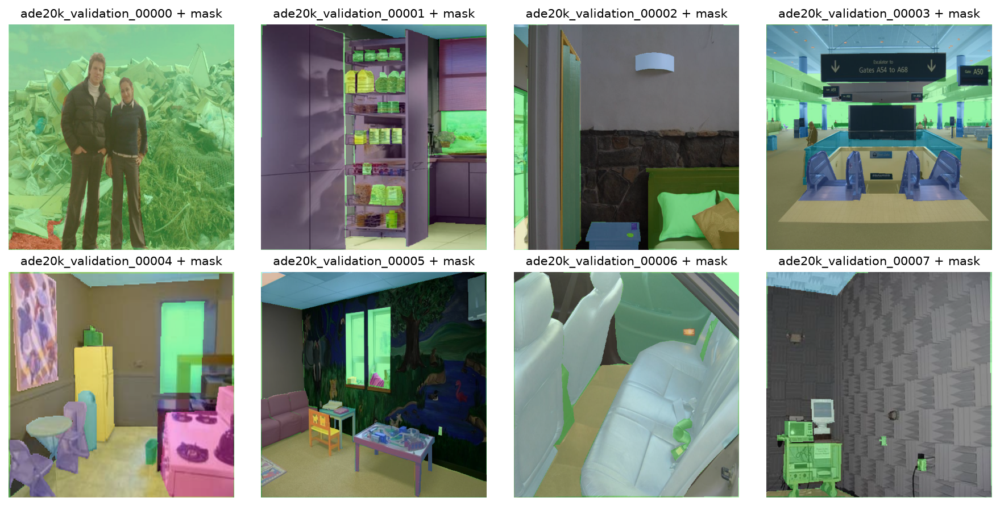

*Figure 2 — Example ADE20K validation scenes used in the experiment (with segmentation masks where available).*

### 5.2 Behavior under distortion

Mean primary metrics over L1–L5:

| Task / metric | Noise | JPEG | Low light | Rain |
|---------------|------:|-----:|----------:|-----:|
| Features match_accuracy | 0.683 | 0.809 | 0.455 | 0.828 |
| Edges edge_f1 | 0.390 | 0.690 | 0.415 | 0.909 |
| Detection detection_f1 | 0.335 | 0.463 | 0.504 | 0.575 |
| Segmentation mIoU | 0.344 | 0.432 | 0.428 | 0.439 |

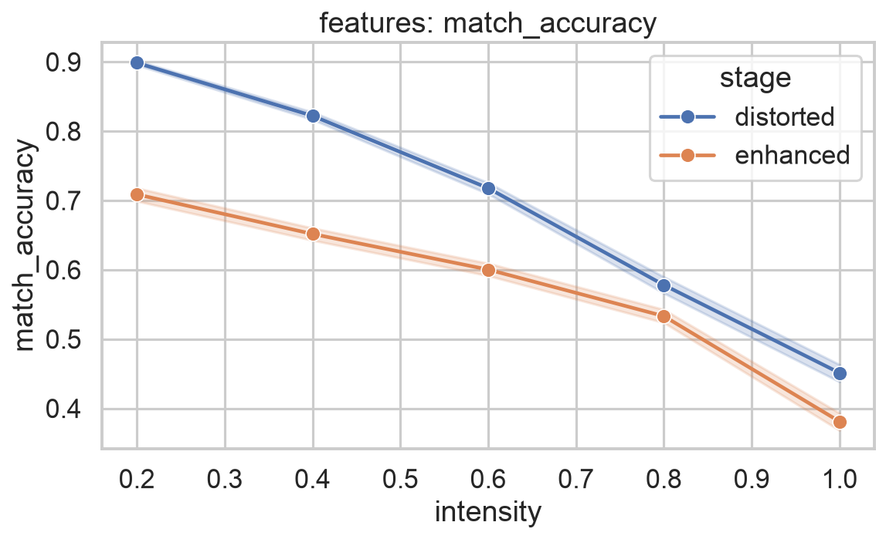

*Figure 3 — ORB match accuracy versus severity. Low light and strong noise hurt correspondence the most.*

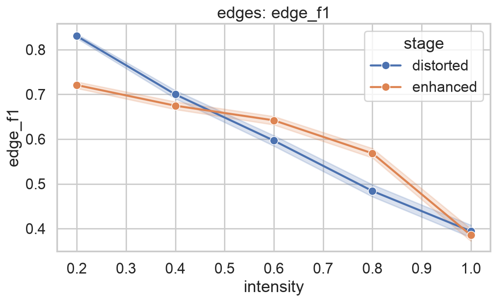

*Figure 4 — Edge F1 versus severity. Noise destroys edge maps; rain is comparatively mild for Canny.*

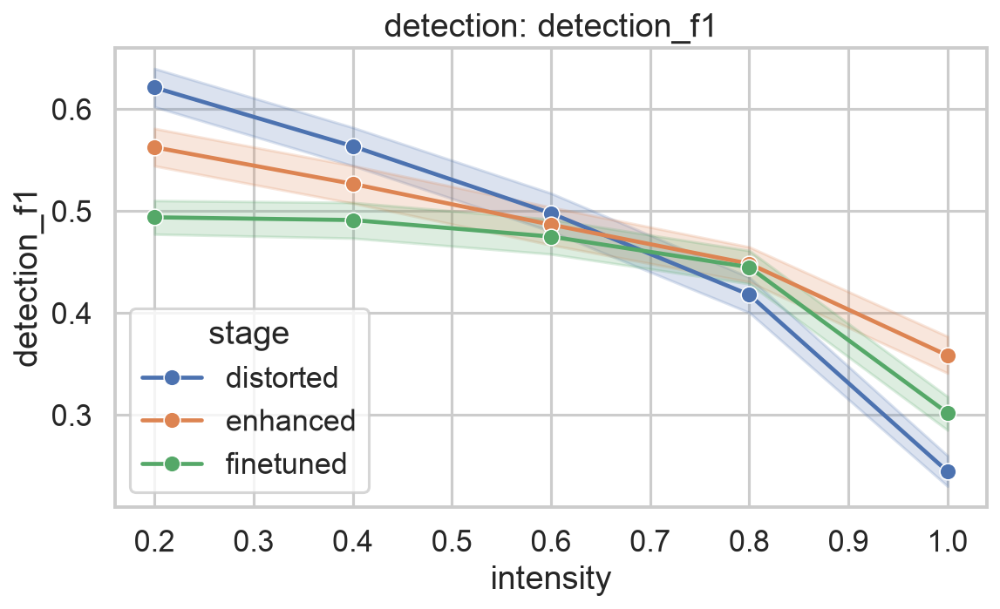

*Figure 5 — YOLO detection F1 versus severity. Performance falls steadily with intensity; noise and severe JPEG/low light are the hardest.*

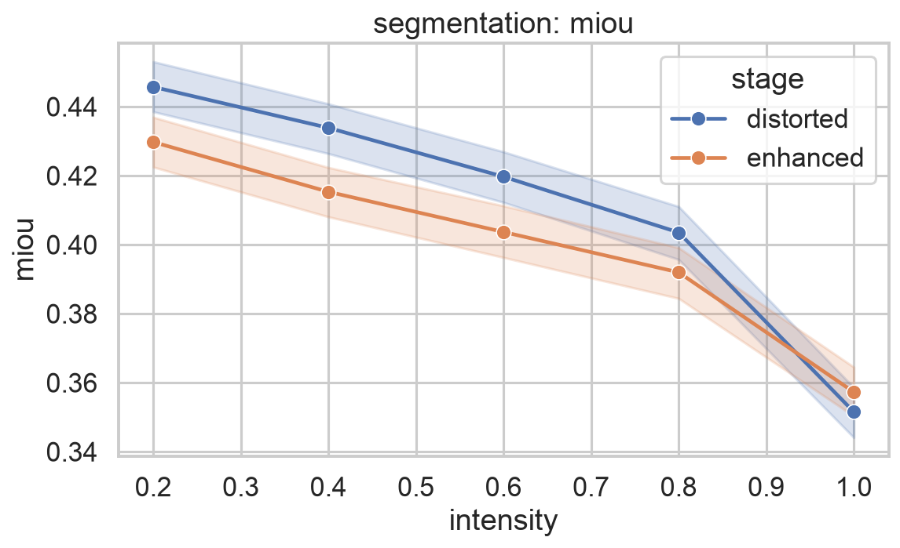

*Figure 6 — SegFormer mIoU versus severity (GT ADE masks). Degradation is smoother than detection, but noise still produces the largest drop.*

**Detection F1 by severity level:**

| Distortion | L1 | L2 | L3 | L4 | L5 |
|------------|---:|---:|---:|---:|---:|
| Gaussian noise | 0.540 | 0.427 | 0.331 | 0.229 | 0.147 |
| JPEG | 0.630 | 0.588 | 0.534 | 0.440 | 0.122 |
| Low light | 0.656 | 0.614 | 0.552 | 0.468 | 0.227 |
| Rain | 0.659 | 0.626 | 0.573 | 0.535 | 0.483 |

**Finding:** stronger severity (lower SNR) → lower accuracy for all tasks. Noise and strong JPEG/low-light hurt detection most; rain is milder.

### 5.3 Recovery through enhancement

Every distorted image is processed with the paired enhancer, and all tasks are re-run.

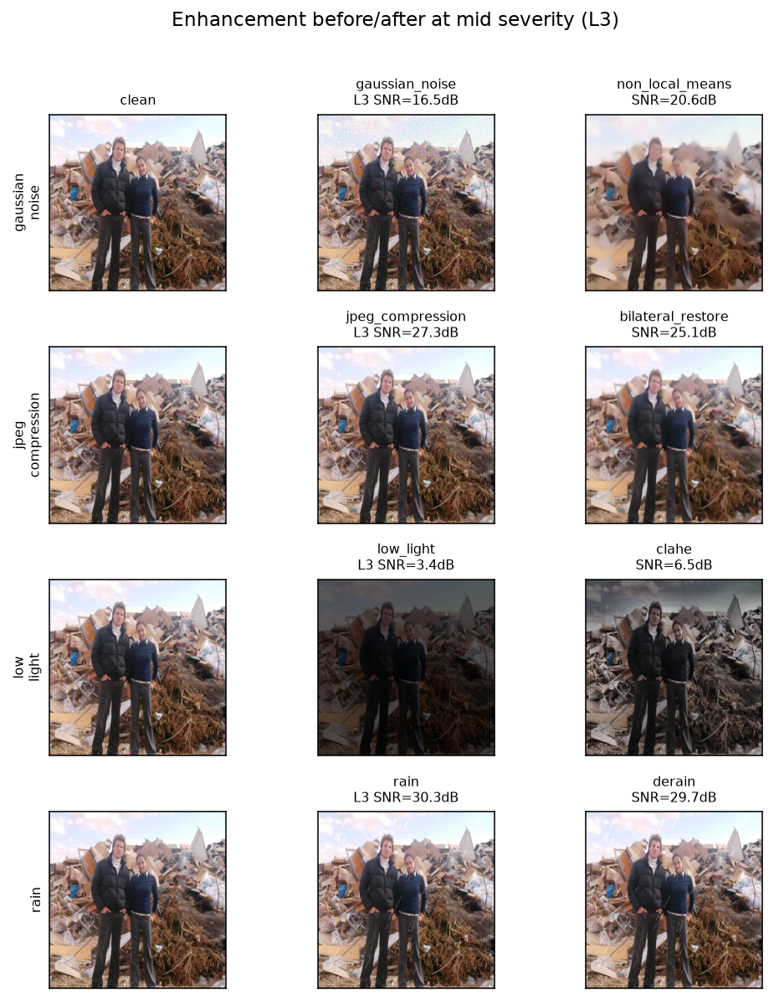

*Figure 7 — Clean, distorted (L3), and enhanced examples for each distortion. NLM and CLAHE are visually clear; JPEG restore and derain are subtler.*

Mean change **enhanced − distorted** (averaged over severities):

| Task | Noise | JPEG | Low light | Rain |
|------|------:|-----:|----------:|-----:|
| Features | −0.211 | −0.095 | −0.124 | −0.045 |
| Edges | **+0.014** | −0.144 | **+0.132** | −0.014 |
| Detection | +0.002 | +0.010 | **+0.026** | −0.008 |
| Segmentation | −0.009 | −0.016 | −0.020 | 0.000 |

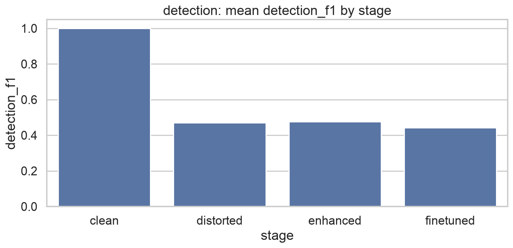

*Figure 8 — Detection F1 by stage (clean / distorted / enhanced), aggregated per distortion.*

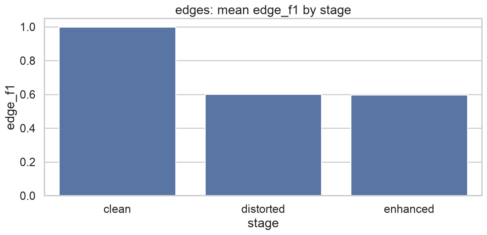

*Figure 9 — Edge F1 by stage. CLAHE under low light is the clearest classical recovery.*

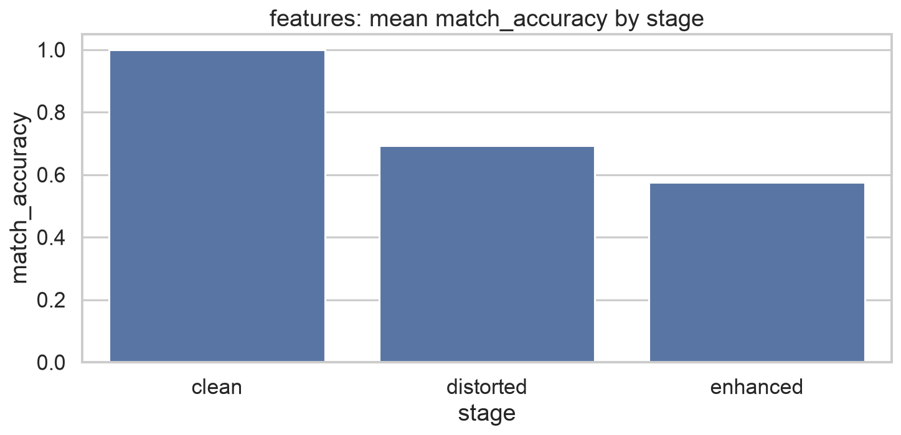

*Figure 10 — Feature match accuracy by stage. Smoothing often hurts ORB distinctiveness even when the image looks cleaner.*

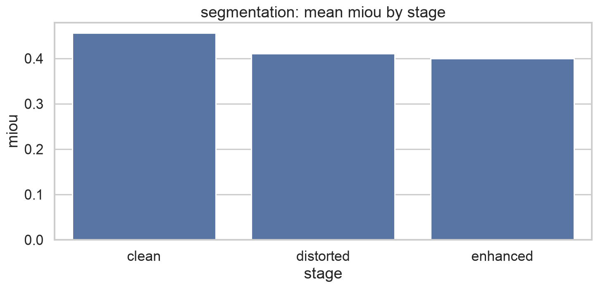

*Figure 11 — Segmentation mIoU by stage. Classical enhancement rarely restores SegFormer accuracy.*

**Finding:** classical enhancement does **not** universally restore task metrics.  
Clear wins: **CLAHE for low-light edges/detection**; mild edge help from denoising.  
Feature matching often drops after smoothing. Visual cleanup ≠ always better algorithm scores.

### 5.4 YOLO fine-tuning (Part 4)

Setup: labels from clean YOLO detections; train on **Gaussian-noise** images at intensity **0.6**; evaluate on all distortions.

| Distortion | Pretrained on distorted | Fine-tuned | Δ |
|------------|------------------------:|-----------:|--:|
| **Gaussian noise** | 0.335 | **0.475** | **+0.140** |
| JPEG | 0.463 | 0.419 | −0.044 |
| Low light | 0.504 | 0.423 | −0.081 |
| Rain | 0.575 | 0.449 | −0.127 |

On the **training condition** (noise @ 0.6): pretrained **0.331** → fine-tuned **0.498** (**+0.167**).

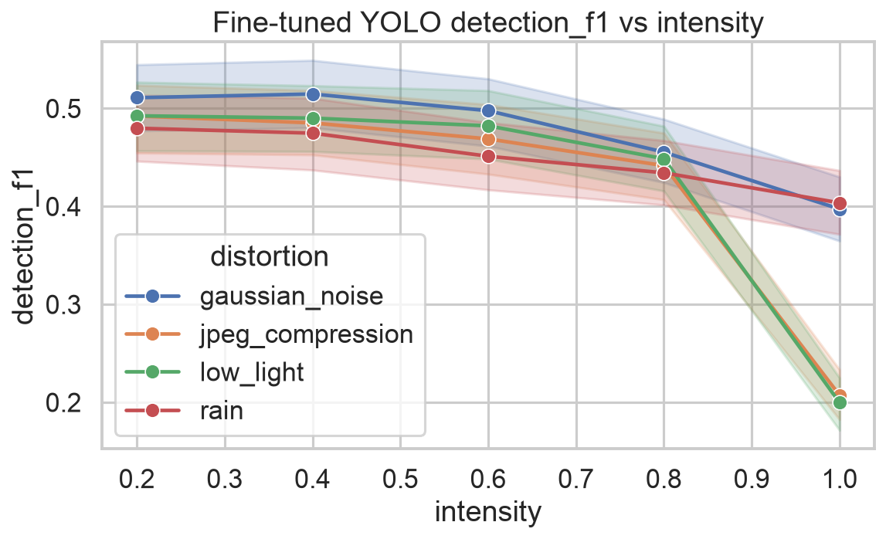

*Figure 12 — Detection F1 after fine-tuning versus the pretrained detector under each distortion.*

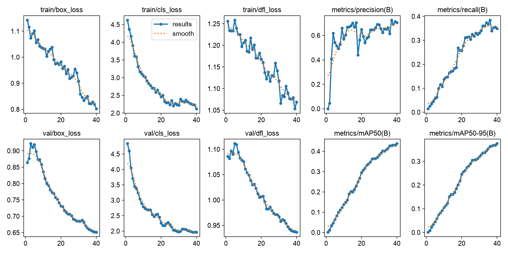

*Figure 13 — Ultralytics training/validation curves for the YOLOv8n fine-tune run.*

**Finding:** with **500 images**, fine-tuning clearly helps the matched distortion (noise). Gains do not automatically transfer to other distortions (some negative transfer).

**Fine-Tuning Implementation**
- DetailsBase Architecture: The evaluation process evaluates the fine-tuned model against the baseline utilizing the yolov8n.pt (nano) weights.
- Dynamic Class Mapping: To ensure fair and accurate evaluation, the pipeline dynamically maps local fine-tuned class IDs back to the original COCO IDs using a generated coco_to_local.yaml mapping file.
- Hardware Agnosticism: The evaluation pipeline dynamically checks the environment and seamlessly falls back to CPU execution if required by the system configuration.  

---

## 6. Conclusions

1. All four tasks degrade as distortion severity rises; SNR is a useful intensity axis.  
2. Noise is among the most damaging corruptions for edges, detection, and segmentation.  
3. Classical enhancements help **selectively** (best evidence: CLAHE under low light).  
4. Detector fine-tuning on distorted data **works** for the trained condition at this scale (500 images).  
5. Activity metrics and GT/stability metrics can disagree — report both.

---

## 9. Repository layout

```text
configs/                  # experiment config
src/vision_robustness/    # package: data, distortions, enhancements, tasks, metrics, pipeline, training
scripts/                  # stage CLIs + orchestrator
tests/                    # unit + smoke tests
results/figures/          # README figures (grids, curves, stages, YOLO history)
results/report/           # compact summary CSVs
presentation/             # final PPT (add before submission)
data/                     # caches (gitignored payloads)
```

---

## 10. Evaluation Methodology & Known Limitations
- Cross-Domain Label Mismatch: The baseline YOLOv8 model is pre-trained on the COCO dataset, whereas our ground-truth (GT) semantic masks originate from ADE20K. To bridge this domain label gap, our pipeline dynamically extracts bounding boxes from the ADE20K semantic masks and performs class-agnostic localization evaluation for YOLO GT metrics.
- Stability vs. Absolute Accuracy: For classical low-level tasks (ORB features and Canny edges), the evaluation metrics reflect algorithm stability under distortion rather than absolute ground-truth accuracy. Performance is measured utilizing the model's prediction on the clean image as a dynamic cascading reference.
- Strict Feature Matching: ORB feature matching accuracy is constrained by a rigorous KNN Lowe's ratio test (ratio = 0.75) to actively filter out ambiguous correspondences. Consequently, the reported match accuracy strictly reflects robust structural persistence.
- Segmentation GT Handling: SegFormer mIoU metric calculations correctly bypass unannotated regions (ignore_index = 255) to prevent artificial inflation of pixel accuracy and background IoU scores.  
